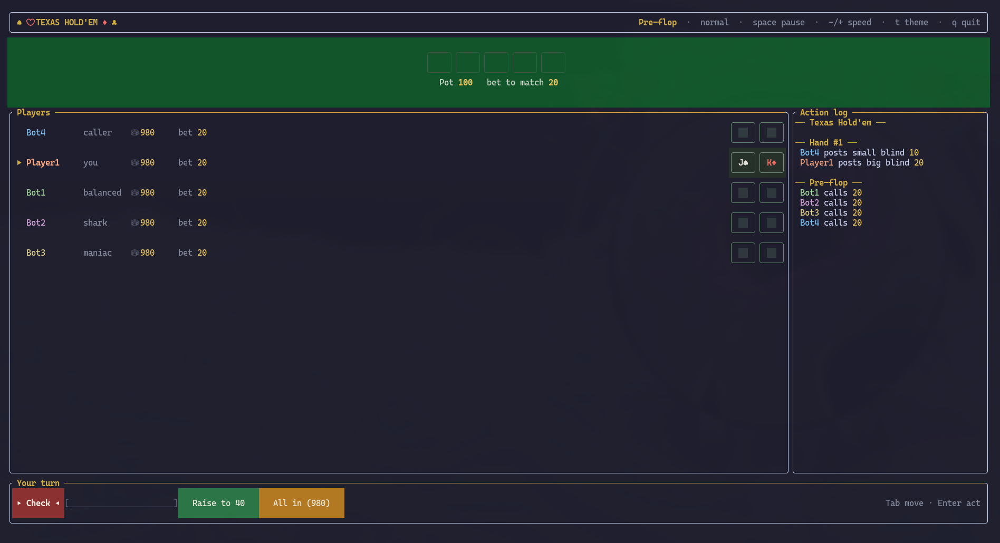

<h1 align="center">
  Terminal Poker
</h1>

  

  A no limits Texas hold 'em poker game with a full-screen terminal UI

  

<h2>
  Build instructions
</h2>
<h3>
  Requirements
</h3>

- CMake 3.14+
- C++17 compatible compiler
- Internet access on first configure (fetches <a href="https://github.com/ArthurSonzogni/FTXUI">FTXUI</a>)

<h3>
  Build
</h3>

    mkdir build && cd build
    cmake ..
    cmake --build .

<h3>
  Run
</h3>

    ./poker

Pick a colour theme (or press <b>t</b> in game to cycle through them):

    ./poker --theme midnight

Available themes: <b>Emerald</b> (default), <b>Midnight</b>, <b>Crimson</b>
and <b>Carbon</b>.

For the original plain-console experience:

    ./poker --classic

<h2>
  How to play
</h2>

  The game opens a full-screen terminal UI showing the table, the community
  cards, every player's chips and bets, and a live action log. 
  When it is your turn an action bar appears at the bottom with
  <b>Fold</b>/<b>Check</b>, <b>Call</b>, a <b>Raise</b> slider and
  <b>All in</b> buttons. 
  Navigate with the mouse, or with Tab/arrow keys and Enter. Press
  <b>space</b> to pause, <b>-</b>/<b>+</b> to change the game speed,
  <b>t</b> to switch theme and <b>q</b> to quit at any time. 

  In classic mode you type your bet instead: 0 folds (or checks when there is
  nothing to call), the minimum bet calls, and anything above raises.

  The game has full support for correct hand evaluations when considering high cards/kickers, pot-splitting and going all-in.

<h3>
  Bot behaviour
</h3>

  Each bot has a personality built from three knobs: <b>tightness</b> (0–2,
  how strong a hand it needs to keep playing), <b>aggression</b> (0–1, how
  often and how big it raises — bet sizes scale with the pot and its hand
  strength) and <b>bluff frequency</b> (0–1, how often it plays a weak hand
  anyway). Hand strength comes from either a monte carlo simulation against
  the remaining opponents, or a simpler made-hand evaluation.

  Six preset styles are available: <b>balanced</b>, <b>shark</b>
  (tight-aggressive), <b>rock</b> (very tight, passive), <b>maniac</b>
  (loose-aggressive), <b>caller</b> (calls almost anything) and <b>fish</b>
  (loose, only sees its own cards). Each bot's style is shown next to its
  name at the table.

<h3>
  Customizing the table
</h3>

  Pick your own lineup of 1–6 bots with <code>--bots</code>. Each entry is
  <code>[Name=]style[(knobs)]</code>, where knobs fine-tune
  <code>t</code>/<code>tightness</code>, <code>a</code>/<code>aggression</code>
  and <code>b</code>/<code>bluff</code>:

    ./poker --bots "Vera=shark,Moe=maniac,Rocky=rock(t=1.8),Cal=caller"

  The default lineup is <code>balanced,shark,maniac,caller</code>.

